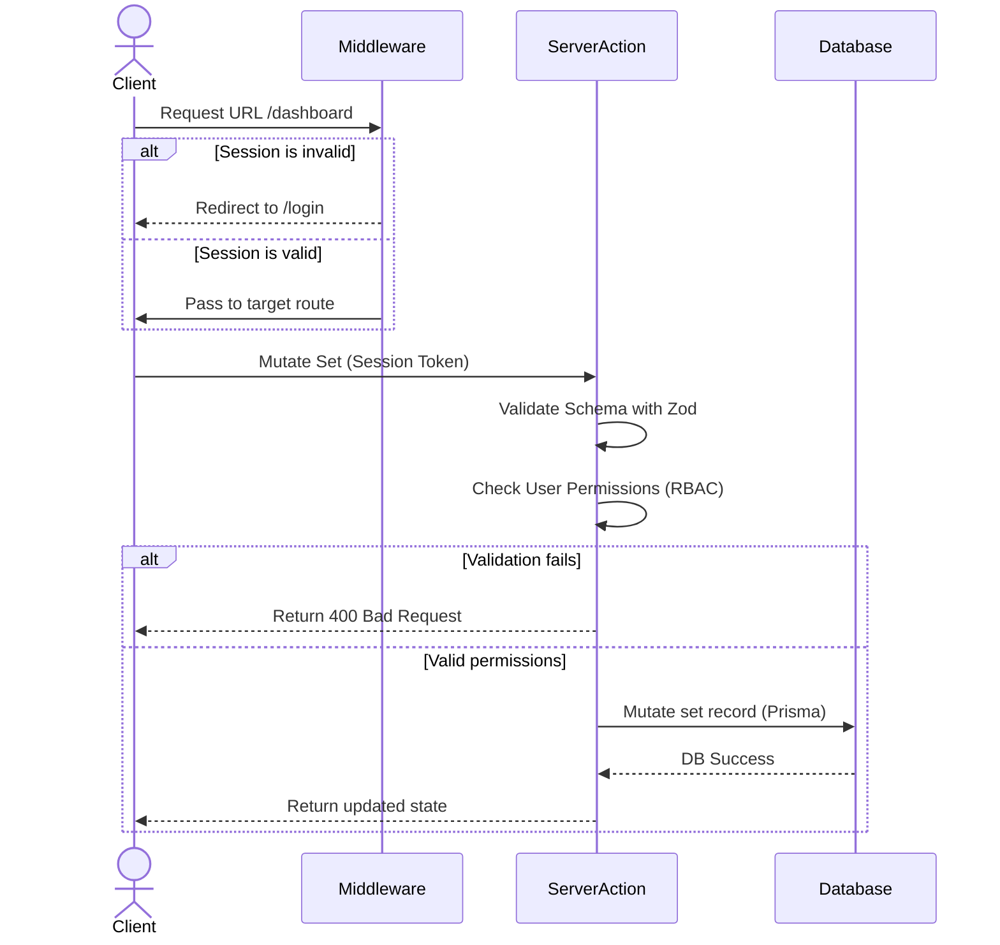

# KAVRIOLAB: MODERN FITNESS OPERATING SYSTEM
## 05. ARCHITECTURAL & TOPOLOGY SPECIFICATION

**Document Version:** 1.0.0-PROD  
**Status:** APPROVED  

This document outlines the architectural blueprints for the KavrioLab application. It describes system data flows, separation of concerns, offline sync mechanics, and state boundaries.

---

## 1. LAYERED SYSTEM TOPOLOGY

KavrioLab is built using a clean, layered architecture within the Next.js 15 App Router framework. This layout separates the UI from core business rules and database mutations.

```
+---------------------------------------------------------------------------------------------------+
|                                     KAVRIOLAB SYSTEM TOPOLOGY                                     |
+---------------------------------------------------------------------------------------------------+
|  PRESENTATION LAYER      |  Client Components (Stateful Forms, Charts, Timers)                    |
|                          |  React Server Components (Pre-rendered Pages & Layouts)                |
+---------------------------------------------------------------------------------------------------+
|  APPLICATION SERVICES    |  Route Handlers & Server Actions (Input Parsing, Session Checks)      |
|                          |  Domain Services (WorkoutService, NutritionService, etc.)              |
+---------------------------------------------------------------------------------------------------+
|  DATA ACCESS LAYER       |  Prisma Client ORM Mapping & Direct Database Repositories              |
|                          |  Redis Cache / Local IndexedDB (Offline Storage)                       |
+---------------------------------------------------------------------------------------------------+
|  INFRASTRUCTURE LAYER    |  PostgreSQL 16 Engine, Vercel Blob API, OpenAI/Gemini Multi-Modal API |
+---------------------------------------------------------------------------------------------------+
```

### 1.1 Layer Definitions
1. **Presentation Layer:** 
   - **React Server Components (RSC):** Fetch baseline data during page request, secure server environments, and render layouts with zero client-side JavaScript overhead.
   - **Client Components:** Handle active workout logging, canvas-based barcode scanning, slide comparison tools, and animations.
2. **Application Services Layer:**
   - **Server Actions & Route Handlers:** Act as system endpoints. They validate inputs using Zod, enforce user authorization checks, and orchestrate service calls.
   - **Domain Services:** Contains core business logic (e.g., TDEE adjustment algorithms, 1RM calculators, and progress validations) decoupled from specific HTTP contexts.
3. **Data Access Layer:**
   - **Repositories:** Abstract database queries using Prisma client operations, enforcing multi-tenant separation filters on every query.
   - **Caching Layer:** Uses Redis for fast lookup of verified foods and active user session states.

---

## 2. NEXT.JS 15 STATE BOUNDARIES & COMPONENT CLASSIFICATION

To maintain performance, components are categorized based on state requirements and interactivity:

```
+---------------------------------------------------------------------------------------------------+
|                                  STATE & RENDER COMPONENT BOUNDARY                                |
+---------------------------------------------------------------------------------------------------+
|  SERVER COMPONENTS (Default)             |  CLIENT COMPONENTS ("use client")                      |
|  • Layout wrappers & navigation shells   |  • Active workout set inputs & live rest timers        |
|  • Static exercise detailed info sheets  |  • Interactive Recharts dashboards & analytics toggles  |
|  • Hydration data payloads from DB       |  • Barcode scanner camera canvas                       |
+---------------------------------------------------------------------------------------------------+
```

- **Server-Side Rendered by Default:** All pages load metadata and query database records via Server Components, sending minimal client bundle sizes.
- **Client Components (use client):** Used only when user interaction (e.g., keyboard input, state toggles, charts) or browser APIs (e.g., WebRTC, Geolocation, IndexedDB) are required.

---

## 3. OFFLINE SYNCHRONIZATION ARCHITECTURE

To support usage in low-connectivity areas like gym basements, KavrioLab implement an offline-first synchronization flow.

```
+---------------------------------------------------------------------------------------------------+
|                                  OFFLINE SYNCHRONIZATION FLOW                                     |
+---------------------------------------------------------------------------------------------------+
| [User Mutation] -> [Online Check] ----(Yes)----> [Server Database Write]                          |
|                          |                                                                        |
|                        (No)                                                                       |
|                          v                                                                        |
|                 [IndexedDB Queue] ---> [Sync Service Worker] ---> [API Reconciliation Endpoint]  |
+---------------------------------------------------------------------------------------------------+
```

### 3.1 Synchronization Lifecycle & Conflict Resolution
1. **Local Writes:** When offline, mutations are saved to an IndexedDB mutation queue, and the local UI state is updated immediately.
2. **Sync Trigger:** A service worker monitors the browser's `navigator.onLine` state and network request states.
3. **Reconciliation:** When connection is restored, mutations are sent sequentially to the server `/api/sync` route in a single request.
4. **Conflict Resolution:** 
   - **Last-Write-Wins (LWW):** Applied for independent metrics like water logs or body weight trends.
   - **Client-Server Merging:** For active workout modifications, if records conflict, the server merges sets based on unique set ID timestamps, alerting the user of unresolved conflicts if they occur.

### 3.2 Local Database Architecture (Dexie.js Wrapper)
- KavrioLab utilizes `Dexie.js` as the structural wrapper around the browser's native IndexedDB api.
- **Local Collections Schema:**
  - `mutations`: `id` (AutoIncrement), `action` (string), `timestamp` (integer), `payload` (JSON).
  - `workoutCache`: `id` (string/UUID), `activeSessionData` (JSON), `updatedAt` (integer).
- **Migration & Sync Hooks:** When the sync worker triggers, it maps over the `mutations` database collections, resolving entries sequentially. Successful server acknowledgments trigger localized deletes on the mutations store.

---

## 4. SECURITY & DATA ROUTING MIDDLEWARE

A global middleware layer intercept requests to enforce access permissions before routing:



---
*End of Document: 05_ARCHITECTURE.md — Proceed to 06_FOLDER_STRUCTURE.md*
