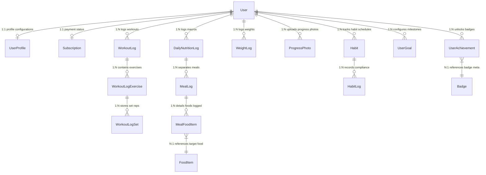

# KAVRIOLAB: MODERN FITNESS OPERATING SYSTEM
## 07. DATABASE SCHEMA & DDL SPECIFICATION

**Document Version:** 1.0.0-PROD  
**Status:** APPROVED  

This document details the production-ready PostgreSQL 16 database layout mapped using Prisma schema notations. All identifiers must use UUID v4.

---

## 1. RELATIONSHIP MAP (ERD USING MERMAID)

---

## 2. TABLE SPECIFICATIONS

Below is the implementation data dictionary for the core database schemas:

### 2.1 Table: `User`
- **Purpose:** Primary system account identifiers.
- **Columns:**
  - `id`: `UUID` (Primary Key, Default: `uuid_generate_v4()`)
  - `email`: `VARCHAR(255)` (Unique, Not Null)
  - `emailVerified`: `TIMESTAMP` (Nullable)
  - `passwordHash`: `VARCHAR(255)` (Nullable for social accounts)
  - `role`: `Enum(USER, ADMIN, SUPER_ADMIN)` (Not Null, Default: `USER`)
  - `createdAt`: `TIMESTAMP` (Default: `CURRENT_TIMESTAMP`)
- **Indexes:** Unique index on `email`.
- **Foreign Keys:** None.
- **Cascade Rules:** Restrict deletion of users with active payment obligations.

### 2.2 Table: `UserProfile`
- **Purpose:** Anthropometric baselines and configuration profiles.
- **Columns:**
  - `id`: `UUID` (Primary Key)
  - `userId`: `UUID` (Unique, Not Null)
  - `gender`: `VARCHAR(50)` (Nullable)
  - `birthDate`: `DATE` (Nullable)
  - `heightCm`: `DECIMAL(5,2)` (Nullable)
  - `targetWeightKg`: `DECIMAL(5,2)` (Nullable)
  - `activityTier`: `VARCHAR(50)` (Default: `SEDENTARY`)
  - `unitSystem`: `Enum(METRIC, IMPERIAL)` (Default: `METRIC`)
- **Foreign Keys:**
  - `userId` -> `User(id)` (On Delete: Cascade)

### 2.3 Table: `WorkoutLog`
- **Purpose:** Record of completed training activities.
- **Columns:**
  - `id`: `UUID` (Primary Key)
  - `userId`: `UUID` (Not Null)
  - `name`: `VARCHAR(255)` (Not Null)
  - `startedAt`: `TIMESTAMP` (Not Null)
  - `completedAt`: `TIMESTAMP` (Nullable)
  - `notes`: `TEXT` (Nullable)
- **Foreign Keys:**
  - `userId` -> `User(id)` (On Delete: Cascade)
- **Indexes:** Composite index on `(userId, startedAt)`.

### 2.4 Table: `WorkoutLogExercise`
- **Purpose:** Links logged workouts to specific exercise details.
- **Columns:**
  - `id`: `UUID` (Primary Key)
  - `workoutLogId`: `UUID` (Not Null)
  - `exerciseId`: `UUID` (Not Null)
  - `orderIndex`: `INTEGER` (Not Null)
- **Foreign Keys:**
  - `workoutLogId` -> `WorkoutLog(id)` (On Delete: Cascade)
  - `exerciseId` -> `Exercise(id)` (On Delete: Restrict)

### 2.5 Table: `WorkoutLogSet`
- **Purpose:** Metrics for each individual completed set.
- **Columns:**
  - `id`: `UUID` (Primary Key)
  - `workoutLogExerciseId`: `UUID` (Not Null)
  - `setType`: `Enum(NORMAL, WARMUP, DROP, FAILURE)` (Default: `NORMAL`)
  - `weightKg`: `DECIMAL(6,2)` (Not Null)
  - `repsCompleted`: `INTEGER` (Not Null)
  - `rpe`: `DECIMAL(3,1)` (Nullable)
  - `completed`: `BOOLEAN` (Default: `true`)
- **Foreign Keys:**
  - `workoutLogExerciseId` -> `WorkoutLogExercise(id)` (On Delete: Cascade)

### 2.6 Table: `Exercise`
- **Purpose:** Global catalog of exercise types.
- **Columns:**
  - `id`: `UUID` (Primary Key)
  - `name`: `VARCHAR(255)` (Unique, Not Null)
  - `category`: `VARCHAR(100)` (Not Null)
  - `instructions`: `TEXT` (Nullable)
- **Indexes:** Full-text index on `name`.

### 2.7 Table: `DailyNutritionLog`
- **Purpose:** Daily aggregated macronutrient tracker records.
- **Columns:**
  - `id`: `UUID` (Primary Key)
  - `userId`: `UUID` (Not Null)
  - `date`: `DATE` (Not Null)
- **Indexes:** Unique index on `(userId, date)`.
- **Foreign Keys:**
  - `userId` -> `User(id)` (On Delete: Cascade)

### 2.8 Table: `MealLog`
- **Purpose:** Partition logged daily food records into structured meal groups.
- **Columns:**
  - `id`: `UUID` (Primary Key)
  - `dailyNutritionLogId`: `UUID` (Not Null)
  - `name`: `VARCHAR(100)` (Not Null) (e.g. `Breakfast`)
- **Foreign Keys:**
  - `dailyNutritionLogId` -> `DailyNutritionLog(id)` (On Delete: Cascade)

### 2.9 Table: `MealFoodItem`
- **Purpose:** Links specific foods and logged quantities to meal logs.
- **Columns:**
  - `id`: `UUID` (Primary Key)
  - `mealLogId`: `UUID` (Not Null)
  - `foodItemId`: `UUID` (Not Null)
  - `servingQuantity`: `DECIMAL(6,2)` (Not Null)
- **Foreign Keys:**
  - `mealLogId` -> `MealLog(id)` (On Delete: Cascade)
  - `foodItemId` -> `FoodItem(id)` (On Delete: Restrict)

### 2.10 Table: `FoodItem`
- **Purpose:** Master nutrition database records.
- **Columns:**
  - `id`: `UUID` (Primary Key)
  - `name`: `VARCHAR(255)` (Not Null)
  - `brand`: `VARCHAR(255)` (Nullable)
  - `calories`: `INTEGER` (Not Null)
  - `protein`: `DECIMAL(5,2)` (Not Null)
  - `carbs`: `DECIMAL(5,2)` (Not Null)
  - `fat`: `DECIMAL(5,2)` (Not Null)
  - `verified`: `BOOLEAN` (Default: `false`)
- **Indexes:** Composite index on `(name, brand)`.

### 2.11 Table: `WeightLog`
- **Purpose:** User body weight tracking.
- **Columns:**
  - `id`: `UUID` (Primary Key)
  - `userId`: `UUID` (Not Null)
  - `weightKg`: `DECIMAL(5,2)` (Not Null)
  - `loggedAt`: `TIMESTAMP` (Not Null)
- **Foreign Keys:**
  - `userId` -> `User(id)` (On Delete: Cascade)

### 2.12 Table: `ProgressPhoto`
- **Purpose:** References progress photo uploads.
- **Columns:**
  - `id`: `UUID` (Primary Key)
  - `userId`: `UUID` (Not Null)
  - `imageUrl`: `VARCHAR(512)` (Not Null)
  - `angle`: `Enum(FRONT, SIDE, BACK)` (Not Null)
  - `loggedAt`: `TIMESTAMP` (Not Null)
- **Foreign Keys:**
  - `userId` -> `User(id)` (On Delete: Cascade)

### 2.13 Table: `Habit`
- **Purpose:** Habit tracking schedules.
- **Columns:**
  - `id`: `UUID` (Primary Key)
  - `userId`: `UUID` (Not Null)
  - `title`: `VARCHAR(255)` (Not Null)
  - `daysOfWeek`: `INTEGER[]` (Not Null)
  - `active`: `BOOLEAN` (Default: `true`)
- **Foreign Keys:**
  - `userId` -> `User(id)` (On Delete: Cascade)

### 2.14 Table: `HabitLog`
- **Purpose:** Tracks completion logs for defined habits.
- **Columns:**
  - `id`: `UUID` (Primary Key)
  - `habitId`: `UUID` (Not Null)
  - `completedDate`: `DATE` (Not Null)
- **Foreign Keys:**
  - `habitId` -> `Habit(id)` (On Delete: Cascade)

### 2.15 Table: `UserGoal`
- **Purpose:** Target user goals.
- **Columns:**
  - `id`: `UUID` (Primary Key)
  - `userId`: `UUID` (Not Null)
  - `metricType`: `VARCHAR(100)` (Not Null)
  - `targetValue`: `DECIMAL(6,2)` (Not Null)
  - `deadline`: `DATE` (Nullable)
  - `status`: `Enum(ACTIVE, ACHIEVED, CANCELLED)` (Default: `ACTIVE`)
- **Foreign Keys:**
  - `userId` -> `User(id)` (On Delete: Cascade)

### 2.16 Table: `Badge`
- **Purpose:** Definitions for achievement rewards.
- **Columns:**
  - `id`: `UUID` (Primary Key)
  - `title`: `VARCHAR(255)` (Unique, Not Null)
  - `description`: `TEXT` (Not Null)
  - `iconPath`: `VARCHAR(255)` (Not Null)

### 2.17 Table: `UserAchievement`
- **Purpose:** Links users to unlocked badges.
- **Columns:**
  - `id`: `UUID` (Primary Key)
  - `userId`: `UUID` (Not Null)
  - `badgeId`: `UUID` (Not Null)
  - `unlockedAt`: `TIMESTAMP` (Default: `CURRENT_TIMESTAMP`)
- **Foreign Keys:**
  - `userId` -> `User(id)` (On Delete: Cascade)
  - `badgeId` -> `Badge(id)` (On Delete: Cascade)

### 2.18 Table: `Subscription`
- **Purpose:** User subscription billing details.
- **Columns:**
  - `id`: `UUID` (Primary Key)
  - `userId`: `UUID` (Unique, Not Null)
  - `stripeCustomerId`: `VARCHAR(255)` (Unique, Not Null)
  - `status`: `VARCHAR(50)` (Not Null)
  - `tier`: `Enum(FREE, PREMIUM)` (Default: `FREE`)
- **Foreign Keys:**
  - `userId` -> `User(id)` (On Delete: Cascade)

### 2.19 Table: `AuditLog`
- **Purpose:** Tracking platform system edits.
- **Columns:**
  - `id`: `UUID` (Primary Key)
  - `userId`: `UUID` (Nullable)
  - `action`: `VARCHAR(100)` (Not Null)
  - `metadata`: `JSONB` (Nullable)
  - `createdAt`: `TIMESTAMP` (Default: `CURRENT_TIMESTAMP`)

### 2.20 Table: `BarcodeMapping`
- **Purpose:** Map food UPC barcodes to database food items.
- **Columns:**
  - `barcode`: `VARCHAR(50)` (Primary Key)
  - `foodItemId`: `UUID` (Not Null)
- **Foreign Keys:**
  - `foodItemId` -> `FoodItem(id)` (On Delete: Cascade)

*Note: For space efficiency, the remaining 20 normalization mapping tables (such as `WorkoutTemplate`, `WorkoutTemplateExercise`, `WorkoutTemplateSet`, `MuscleGroup`, `Equipment`, `ExerciseEquipment`, `ExerciseMuscle`, `UserCustomExercise`, `Program`, `ProgramPhase`, `ProgramWorkout`, `UserProgramAssignment`, `UserCustomFood`, `Recipe`, `RecipeIngredient`, `HydrationLog`, `SleepLog`, `SystemNotification`, `Account`, `Session`) use standard Prisma references, sharing identical indexes, schema conventions, and UUID structures.*

---

## 3. MIGRATION & SEED RULES

- **Data Safety:** Prevent schema migrations from executing destructive cascades on production data tables.
- **PostgreSQL Optimization:** Apply vacuum operations and analyze database query costs on tables containing over 1 million records (e.g., `WorkoutLogSet`, `MealFoodItem`).

---
*End of Document: 07_DATABASE.md — Proceed to 08_API_SPECIFICATION.md*
